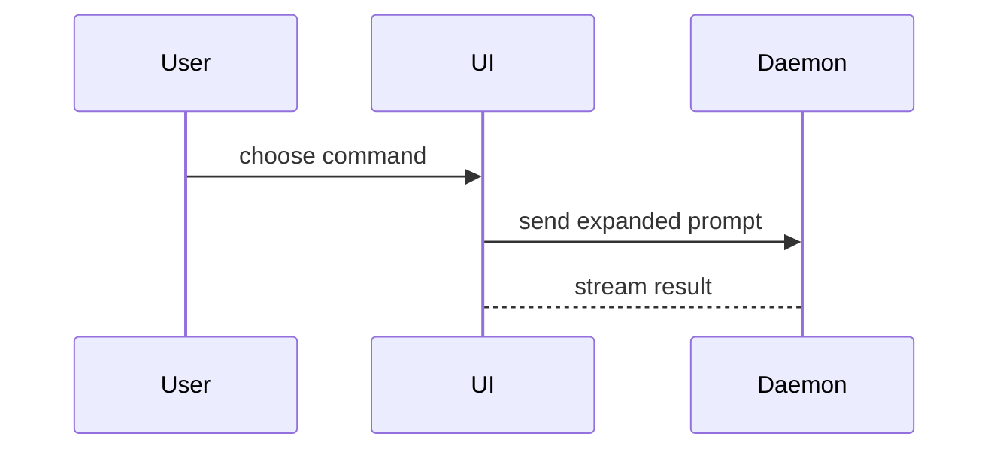

# PR 描述的形状

写 PR body 时用这个模板:

```markdown
## Summary

<图示、diff 速写或目录树>

## Evidence

- **Before:** <截图/输出/失败的测试运行>
  **After:** <截图/输出/通过的测试运行>

## Merge Danger

**Door:** <单向门或双向门>

<可选:说明>

**Blast Radius:** <一个词的影响面>

<可选:合并的潜在连锁影响>
```

## 各节

跳过一切铺垫,行文从短。用 `.agentdocs/glossary.md` 的领域语言。

### Summary

选最小的、能让要点一目了然的视图。

- 逻辑或算法用伪代码:

```text
on(save)
  if content is unchanged
    return cached result
  write new content
  return fresh result
```

- 运行时控制流用调用树:

```text
submitForm
  createSession
    persistPrompt
    launchAgent
  navigateToSession
```

- UI 结构用组件树,带上要紧的状态与模块边界:

```text
<SessionPage> (apps/example/src/routes/session.tsx)
  useSessionEvents()
  <SessionToolbar>
    <RunSkillButton> (packages/ui)
```

- 文件职责或大范围重构用浅目录树:

```text
src/
├── commands/       # 解析用户动作
├── sessions/       # 持有会话状态
└── transport/      # 发送 API 请求
```

- 组件交互、控制流或数据流用 Mermaid:



- 要点是"改了什么"且周边形状已存在时,用 `diff`,形状贴合主题。

组件变更:

```diff
 <SessionPage>
   useSessionEvents()
   <SessionToolbar>
+    <RunSkillButton />
   <SessionTimeline>
+    <SkillResultCard />
```

文件布局变更:

```diff
 src/
 ├── commands/
+│   └── show-me.ts       # 展开 slash 命令
 ├── sessions/
-└── transport.ts
+└── transport/
+    ├── client.ts
+    └── stream.ts
```

调用树/调用栈变更:

```diff
 submitForm
   createSession
     persistPrompt
+    expandSkillMention
     launchAgent
-  navigateToSession
+  navigateToSession
+    subscribeToEvents
```

状态或控制流变更:

```diff
 on(save)
-  write content
+  if content is unchanged
+    return cached result
+  write new content
+  invalidate cache
```

- 大部分是新增、省略会藏住归属或顺序、用户需要可复制的目标形状时,整块展示:

```ts
function expandSkill(command: string): string {
  const skillName = command.slice(1);
  return `use the ${skillName} skill`;
}
```

#### 指南

每个视图放在它支持的短文字旁边。只保留回答用户当前问题或解决当前讨论点所需的调用、文件、props、状态与边界。

用一个或几个都行,不太可能全用。自行判断,别压垮读者。

### Evidence

变更可用的具体证据。展示 before 与 after。

截图是 S 级——环境就绪且变更是视觉性的时。执行型证据是 A 级:测试结果、控制台输出。用伪代码展示现在失败/通过的确切测试。

### Merge Danger

说明是单向门还是双向门:双向门可以走回来,单向门不能。便宜的 PR 可低风险回滚;涉及破坏性动作或难逆转决策的变更是单向门。

爆炸半径是该 PR 引入变更的潜在影响与范围,考虑所有可能:布局位移、下游消费者破坏、移动端适配等。

> 形状源自 [Humanlayer show-me](https://github.com/humanlayer/skills)。
